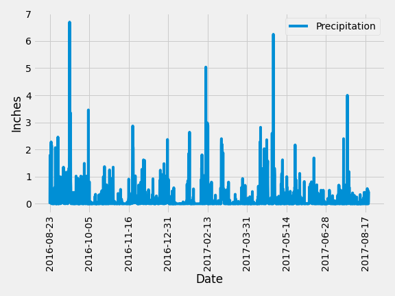

# SQLAlchemy Challenge
## Summary
This challenge is composed of two parts:
* Pandas-Matplotlib analysis  
    * Basic climate analysis and data exploration of a SQLite database 
    * Use SQLAlchemy ORM queries, Pandas, and Matplotlib.
* API app
    * Flask API based on the queries developed in the analysis.

## Tools used
* Matplotlib
* Pandas
* SQLAlchemy
* Flask

## Analysis result
### Precipitation Analysis

### Temperature Analysis 

## API Screenshot
### Main

### Precipitation

### Stations

### Temperatures

### Start

### Start/End

